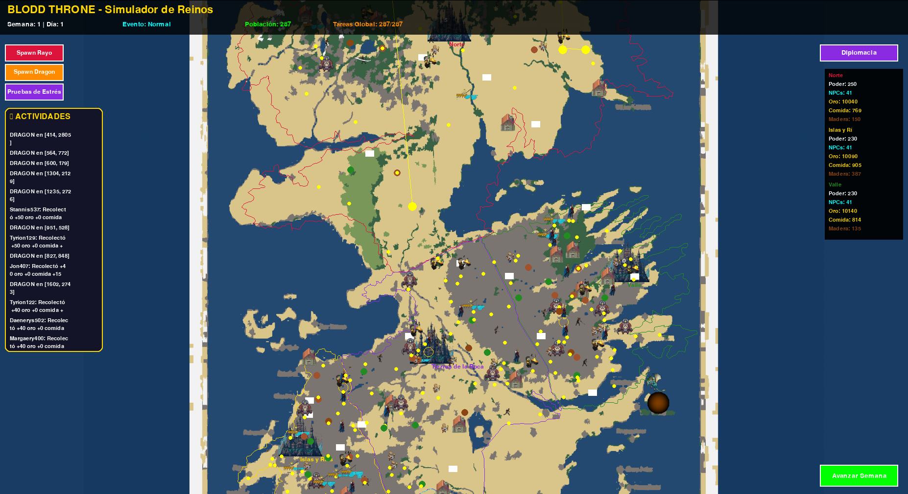
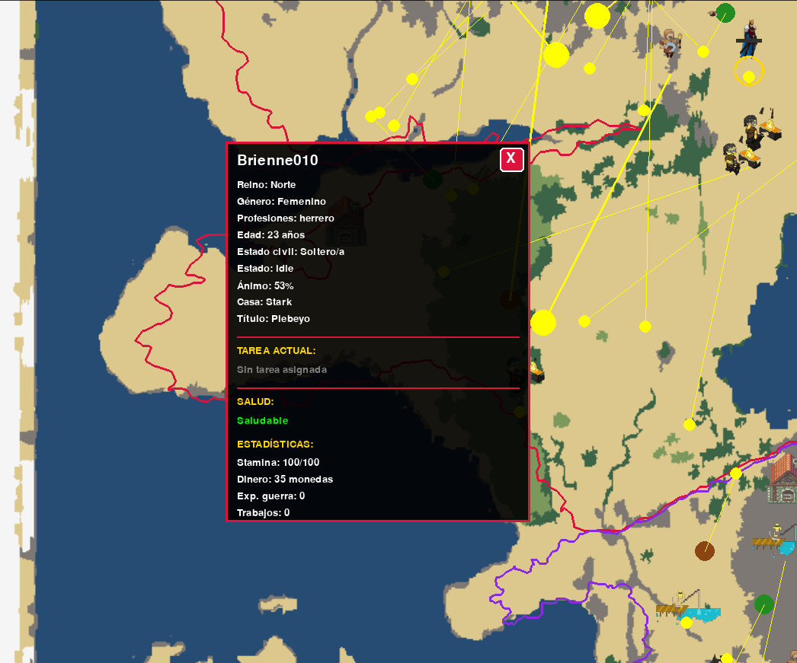

<!-- Elegant README (HTML-in-Markdown friendly) -->

      <h1 style="margin:0; font-size:28px; color:#fff;">Dwarf-Fortress-style: Game of Thrones Simulation</h1>
      
Simulador político-económico en Python + Pygame con decisiones autónomas vía <b>heap de prioridad</b>.

    

  

  <!-- Badges -->
  

    
    
    
  

  <!-- Divider -->
  

  <!-- Purpose -->
  <h2 style="color:#fff; font-size:22px; margin:0 0 8px">🎯 Propósito</h2>
  

    Demostrar cómo <b>estructuras de datos</b> (heaps, deques, diccionarios) y <b>lógica de simulación</b> pueden
    orquestar un mundo vivo: casas, reinos, tareas, sucesiones y guerras; todo con GUI fluida.
  

  <!-- Features -->
  <h2 style="color:#fff; font-size:22px; margin:18px 0 8px">🚀 Características</h2>
  <ul style="margin:0 0 10px 18px; color:#c9d1d9">
    <li><b>NPCs dinámicos</b>: estamina, moral, lealtad, estrés y rendimiento afectan sus decisiones.</li>
    <li><b>Heap de prioridad</b>: asigna tareas (agricultura, minería, defensa) según urgencia del reino.</li>
    <li><b>Política y sucesiones</b>: herencias, ascenso de casas vasallas, guerra y diplomacia.</li>
    <li><b>Mapa con límites</b>: polígonos JSON (tierra/mar) evitan fugas y bloqueos de trayectorias.</li>
    <li><b>GUI en tiempo real</b>: zoom/cámara, sprites 15×15, paneles de eventos y coordenadas.</li>
  </ul>

  <!-- Quick Start -->
  <h2 style="color:#fff; font-size:22px; margin:18px 0 8px">⚙️ Instalación rápida</h2>
  <pre style="background:#161b22; border:1px solid #30363d; padding:14px; border-radius:10px; overflow:auto; margin:0 0 10px"><code>git clone https://github.com/SalvadorNuso/Dwarf-Fortress---GoT
cd Dwarf-Fortress---GoT
python -m venv .venv
source .venv/bin/activate   # Windows: .venv\Scripts\activate
pip install pygame
python main.py
</code></pre>

  <!-- Controls -->
  

    
<b>🎮 Controles rápidos</b>

    

      <table style="width:100%; border-collapse:collapse; color:#c9d1d9">
        <thead>
          <tr>
            <th style="text-align:left; border-bottom:1px solid #30363d; padding:6px">Acción</th>
            <th style="text-align:left; border-bottom:1px solid #30363d; padding:6px">Tecla / Evento</th>
          </tr>
        </thead>
        <tbody>
          <tr><td style="padding:6px; border-bottom:1px solid #21262d">Mover cámara</td><td style="padding:6px; border-bottom:1px solid #21262d">Flechas</td></tr>
          <tr><td style="padding:6px; border-bottom:1px solid #21262d">Zoom</td><td style="padding:6px; border-bottom:1px solid #21262d">Rueda del ratón</td></tr>
          <tr><td style="padding:6px; border-bottom:1px solid #21262d">Mostrar coordenadas</td><td style="padding:6px; border-bottom:1px solid #21262d">C</td></tr>
          <tr><td style="padding:6px; border-bottom:1px solid #21262d">Inspeccionar castillo</td><td style="padding:6px; border-bottom:1px solid #21262d">Clic izquierdo</td></tr>
          <tr><td style="padding:6px; border-bottom:1px solid #21262d">Pausar juego</td><td style="padding:6px; border-bottom:1px solid #21262d">Tecla P</td></tr>
          <tr><td style="padding:6px">Salir</td><td style="padding:6px">Esc / cerrar ventana</td></tr>
        </tbody>
      </table>
    

  

  <!-- Architecture -->
  <h2 style="color:#fff; font-size:22px; margin:18px 0 8px">🏗️ Arquitectura (resumen)</h2>
  

    

      <b>Núcleo</b>
      <ul style="margin:8px 0 0 18px; color:#c9d1d9">
        <li><code>main.py</code>: bucle principal (frames vs. tick lógico semanal).</li>
        <li><code>priority_heap.py</code>: heap min-prioritario (O(log n)).</li>
        <li><code>sistemas_tareas.py</code>: scheduler y asignación de NPCs.</li>
      </ul>
    

    

      <b>Dominio</b>
      <ul style="margin:8px 0 0 18px; color:#c9d1d9">
        <li><code>npc_got.py</code>: estados (estamina, moral, lealtad, estrés).</li>
        <li><code>models_got.py</code>, <code>enums_got.py</code>: Casa, Reino, Tarea.</li>
      </ul>
    

    

      <b>Visual</b>
      <ul style="margin:8px 0 0 18px; color:#c9d1d9">
        <li><code>sistema_coordenadas.py</code> y GUI (Pygame).</li>
        <li><code>exports/*.json</code>: polígonos de territorios (tierra/mar).</li>
        <li><code>assets/</code>: sprites 15×15 y recursos.</li>
      </ul>
    

  

  <!-- How it works -->
  <h2 style="color:#fff; font-size:22px; margin:18px 0 8px">🧠 Cómo funciona (muy breve)</h2>
  <ol style="margin:0 0 10px 18px; color:#c9d1d9">
    <li>La GUI se actualiza <b>cada frame</b>; la lógica pesada corre en un <b>tick semanal</b>.</li>
    <li>El <b>heap</b> prioriza tareas según recursos, eventos y estados de NPCs.</li>
    <li>El <b>Gestor de Tareas</b> asigna y avanza progreso sin bloquear el frame.</li>
    <li>La <b>lógica política</b> aplica sucesiones/guerras y re-prioriza el heap.</li>
  </ol>

  <!-- Screenshots -->
  

    
<b>🖼️ Capturas GUI y stats(abre para ver)</b>

    

      
      
    

  

  <!-- Troubleshooting -->
  <h2 style="color:#fff; font-size:22px; margin:18px 0 8px">🛠️ Problemas comunes</h2>
  <ul style="margin:0 0 10px 18px; color:#c9d1d9">
    <li>El mapa no carga: verifica <code>exports/got_tiles.json</code> y rutas.</li>
    <li>NPC en el mar: revisa polígonos de territorio (tierra) y color de colisión.</li>
    <li>FPS bajos: reduce NPCs, tamaño de ventana o activa culling agresivo.</li>
  </ul>

  <!-- Footer -->
  

  

    Hecho por <b>Rafael Salvador Núñez Solís, Rommel Macias, Salvador Acero</b> • Python + Pygame
  

